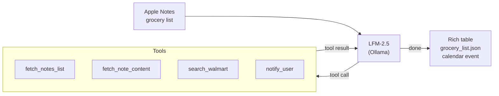

<p align="center">
  
</p>

<p align="center">
  A CLI that turns your Apple Notes grocery list into a priced Walmart shopping list.<br/>
  Runs entirely on your Mac — no cloud, no API keys required.
</p>

---

## What it does

You write a grocery list in Apple Notes. grosme reads it, searches Walmart for each item, picks the best match (factoring in brand, size, and price), and gives you a table with everything priced out. Optionally drops a calendar event on your Mac so you don't forget to actually go shopping.

It uses [Liquid AI's LFM-2.5 Thinking](https://www.liquid.ai/liquid-foundation-models) (1.2B params) running locally through Ollama as the reasoning engine. The model decides which tools to call and how to interpret results — it's a proper agent loop, not just prompt-in/text-out.

## End-to-end flow



What happens at each step:

1. `memo` CLI pulls your grocery list from Apple Notes. grosme parses each line, extracts quantities (`× 2`), and deduplicates.
2. For each item, a stealth browser (Scrapling/Camoufox) scrapes Walmart search results. If the browser returns stale data, it falls back to Jina.
3. Products are ranked by brand match, keyword overlap, size match, then price. The right Eggland's Best beats a cheaper Great Value.
4. Results go to a terminal table and a JSON file. With `--notify`, an Apple Calendar event gets created for tomorrow at 10 AM.

## Quick start

Prerequisites: macOS, Python 3.12+, [Ollama](https://ollama.com), [memo CLI](https://github.com/antoniorodr/memo) (`brew tap antoniorodr/memo && brew install antoniorodr/memo/memo`)

```bash
git clone https://github.com/yourusername/grosme.git
cd grosme
make setup    # installs deps, Camoufox browser, and pulls LFM-2.5
```

```bash
# Search from text
uv run python main.py --text "milk, eggs, bread, chicken breast"

# Use an Apple Note (run `memo notes` to see indices)
uv run python main.py --note 2

# Browse notes interactively
uv run python main.py --notes

# Add a calendar reminder when done
uv run python main.py --note 2 --notify
```

## Example output

```
                         Walmart Grocery List
┌───┬──────────────────────┬─────┬───────────────────────┬─────────┬───────┬───────┬──────────┐
│ # │ Item                 │ Qty │ Best Match            │ Brand   │ Size  │ Price │ Subtotal │
├───┼──────────────────────┼─────┼───────────────────────┼─────────┼───────┼───────┼──────────┤
│ 1 │ Strawberries 1 lb    │  2  │ Fresh Strawberries    │ Dole    │ 1 lb  │ $2.73 │   $5.46  │
│ 2 │ Whole Milk Gallon    │  1  │ Great Value Whole ... │ GV      │ 1 gal │ $3.62 │   $3.62  │
│ 3 │ Eggland's Best 18 ct │  1  │ Eggland's Best Lar...│ EB      │ 18 ct │ $4.97 │   $4.97  │
└───┴──────────────────────┴─────┴───────────────────────┴─────────┴───────┴───────┴──────────┘

Estimated total: $14.05
3/3 items found
```

## How the agent works

grosme uses Ollama's tool-calling API. The LFM-2.5 model gets a system prompt and four tools:

| Tool | What it does |
|---|---|
| `search_walmart(query)` | Scrapes Walmart search, scores products, returns top 3 |
| `fetch_notes_list()` | Lists Apple Notes via memo CLI |
| `fetch_note_content(index)` | Reads a specific note's content |
| `notify_user(message)` | Creates an Apple Calendar event via osascript |

The model decides the order of tool calls. For note-based input, grosme bypasses the agent and searches directly (faster, same results). For free-text input (`--text`), the agent reasons about how to break down the query.

## Known limitations

1. Scrapling can go stale. After ~10 sequential searches, the stealth browser sometimes returns cached results from a previous query. We detect this (if the top result URL matches the last search) and fall back to Jina, but it's a band-aid. A proper fix would be rotating browser profiles or using separate browser contexts per search.

2. Brand matching is a hardcoded list. We maintain a list of ~90 grocery brands. If yours isn't on the list, the relevance scorer can't boost it. This should eventually be replaced with fuzzy matching or a small embedding model.

3. Walmart only. Prices and availability are specific to walmart.com. No support for other retailers yet.

4. macOS only. Apple Notes reading (via memo CLI) and Calendar event creation (via osascript) are macOS-specific. The Walmart search and agent loop would work cross-platform, but the integrations don't.

5. No cart integration. grosme shows you what to buy and what it costs, but can't add items to your Walmart cart. Walmart's cart API isn't public.

6. Price accuracy. Scraped prices reflect what's on the search results page, which may differ from the actual item page (sales, multi-buy deals, regional pricing).

## Next steps

1. Multi-retailer support — add Target, Kroger, or Instacart as search backends. The agent architecture already supports this, just add new tools.

## Project structure

```
grosme/
├── main.py          CLI, note parsing, display, output
├── agent.py         Ollama agent loop (tool-calling)
├── tools.py         Walmart search, Apple Notes, Calendar, scoring
├── schemas.py       Pydantic models
├── tests/           UAT tests
├── assets/          Logo
├── Makefile         Setup, run, test, demo targets
└── pyproject.toml   Dependencies (Python 3.12+, Ollama, Scrapling, etc.)
```

## Config

| Variable | Default | What it controls |
|---|---|---|
| `GROSME_MODEL` | `lfm2.5-thinking:latest` | Which Ollama model to use |
| `OLLAMA_BASE_URL` | `http://localhost:11434` | Ollama server address |
| `JINA_API_KEY` | _(none)_ | Optional — enables Jina as search fallback |
| `GROSME_CALENDAR_NAME` | `Calendar` | Which Apple Calendar to create events on |

## License

MIT
